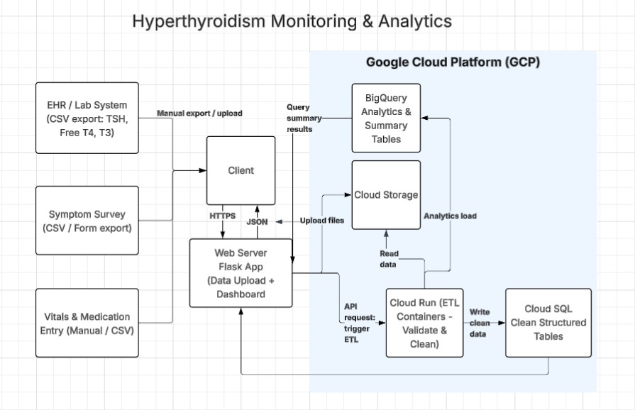

# Architecture & Implementation Plan 

## Instructions : 
* Create a high-level architecture diagram showing how the components fit together.
* Describe how each cloud service will be used, and connect back to prior coursework.
* Plan must include:
  1. Service mapping
  2. Data flow narrative
  3. Security, Identity, and Governance Basics (1–2 paragraphs)
     * How would you manage credentials (e.g., environment variables)?
     * What kinds of access controls / RBAC would be needed?
     * From a high level, how do you avoid putting real PHI into public environments?
  4. Cost and Operational Consideration (1–2 paragraphs)
     * Which components might cost the most (compute vs. storage vs. AI).
     * Where you might use serverless / scheduled jobs instead of always-on VMs.
     * Any decisions you’d make to keep this in a “student budget” or free tier.

## Architecture Diagram 

## 1. Service Mapping 
| Layer | Cloud Service | Role in Solution | Related Coursework |
|:-------:|:-------:|:-------:|:-------:|
| Frontend | Flask App | Upload data & display results | Assignment 2 |
| Storage | GCP Cloud Storage | Store CSV uploads | Module 6 |
| Compute | Cloud Run | Runbackend API & ETL | Assignment 3 & Module 5 |
| Database | Cloud SQL | Store cleanned thyroid data | Assignment 4 & Module 7 |
| Analytics | BigQuery | Trend analysis on TSH/T4/T3 | Module 7 |

## 2. Data Flow Narrative 
Step 1: The user uploads the thyroid lab and symptom CSV files via Flask.
Step 2: Files are stored in cloud object storage.
Step 3: A containerized service parses and cleans the data.
Step 4: Cleaned records are inserted into a SQL database.
Step 5: Analytics compute hormone trends and flags.
Step 6: Flask app displays tables and charts for monitoring.

## 3. Security, Identity, and Governance Basics

## 4. Cost and Operational Considerations
